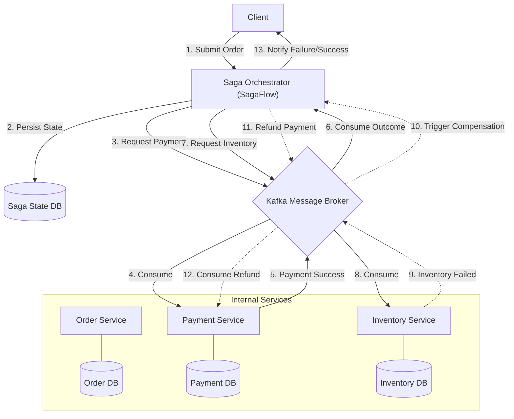

# SagaFlow: Architectural Design

SagaFlow is a distributed orchestrator designed to maintain data consistency across microservices using the **Saga Pattern**. Specifically, it uses **Orchestration** (as opposed to Choreography), where a central component manages the state and flow of the transaction.

## 🏗️ High-Level Architecture

The diagram below shows how SagaFlow coordinates between independent services using **Kafka** as the communication backbone.

## 🔄 The Transactional Flow

### 1. Success Path (The Happy Path)
1.  **Orchestrator** receives a request and creates a "Saga Instance" in its local **Database** with status `STARTED`.
2.  It sends a `PROCESS_PAYMENT` command to the `payment-request` topic.
3.  **Payment Service** handles the request and publishes a `PAYMENT_COMPLETED` event.
4.  **Orchestrator** receives the event, updates its state, and sends a `RESERVE_INVENTORY` command.
5.  **Inventory Service** confirms availability and publishes `INVENTORY_RESERVED`.
6.  **Orchestrator** marks the Saga as `COMPLETED`.

### 2. Failure Path (Compensating Transactions)
Sagas don't have "Rollback" in the traditional sense. Instead, we use **Compensation**:
1.  If the **Inventory Service** fails (e.g., out of stock), it publishes an `INVENTORY_FAILED` event.
2.  The **Orchestrator** identifies that the Payment has already been taken.
3.  It issues a `REFUND_PAYMENT` command to the `payment-request` topic.
4.  The **Payment Service** processes the refund.
5.  The **Orchestrator** marks the Saga as `FAILED_AND_REVERTED`.

## 🛠️ Key Technical Details

- **Eventual Consistency**: Not all databases are updated at the exact same millisecond, but the system guarantees they will *eventually* be correct.
- **Idempotency**: Every consumer (Payment, Inventory) must be designed to handle the same message twice without causing duplicate charges or deductions.
- **State Machine**: The Orchestrator uses a state machine to track exactly where a transaction is at all times, surviving system crashes or Kafka rebalances.
